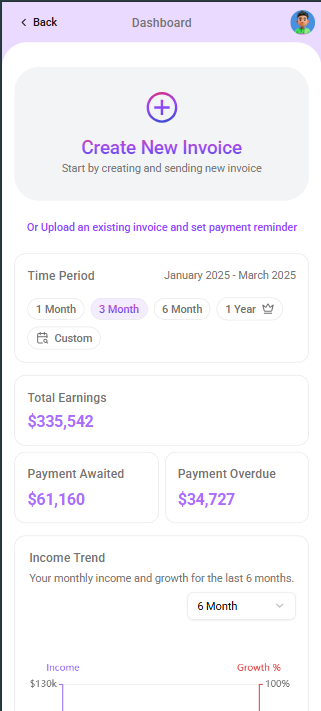
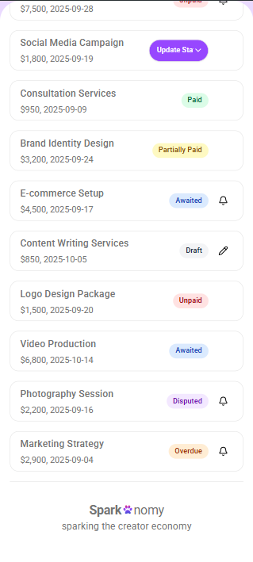

# Sparkonomy UI

A modern and responsive UI for Sparkonomy, a personal finance management application.

## ✨ Features

*   Dashboard with key financial overviews
*   Income and expense tracking
*   Interactive charts for data visualization
*   Invoice management
*   Responsive design for desktop and mobile devices

## 🚀 Technologies Used

*   **Frontend:** React, Vite, TypeScript
*   **Styling:** Tailwind CSS, shadcn/ui
*   **Charting:** ECharts
*   **Linting & Formatting:** ESLint, Prettier
*   **Testing:** Vitest, React Testing Library

## 🏁 Getting Started

### Prerequisites

*   Node.js (v18 or higher)
*   npm

### Installation

1.  Clone the repository:
    ```bash
    git clone https://github.com/yash1501-arch/sparkonomy-ui.git
    ```
2.  Navigate to the project directory:
    ```bash
    cd sparkonomy-ui-main
    ```
3.  Install the dependencies:
    ```bash
    npm install
    ```

### Development

To start the development server, run the following command:

```bash
npm run dev
```

The application will be available at `http://localhost:5173`.

## scripts-section-title Available Scripts

In the project directory, you can run:

| Command         | Description                                    |
| --------------- | ---------------------------------------------- |
| `npm run dev`   | Starts the development server.                 |
| `npm run build` | Builds the app for production.                 |
| `npm run test`  | Runs the tests in watch mode.                  |
| `npm run lint`  | Lints the code using ESLint.                   |
| `npm run format`| Formats the code using Prettier.               |

## 📸 Screenshots

### Desktop


### Mobile





## 📄 License

This project is licensed under the MIT License.