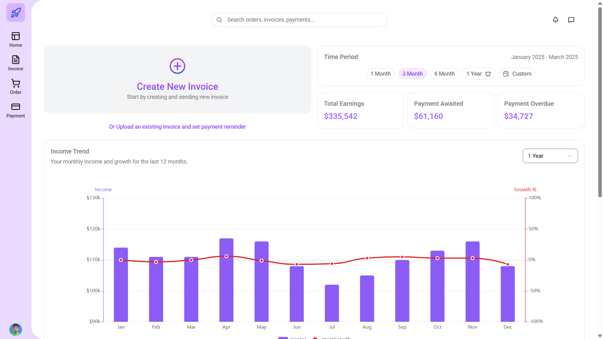
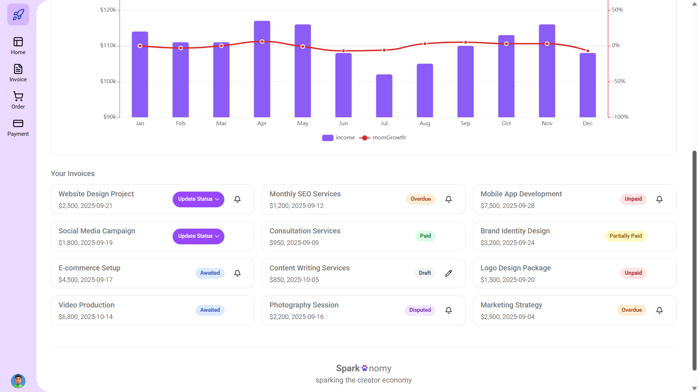

<div align="center">
  <br />
    <h1>Sparkonomy UI - Invoice Management Dashboard</h1>
  <br />

  <div>
    
    
    
    
        
  </div>

  <h3 align="center">A modern, responsive invoice management dashboard built with React 19, TypeScript, and Vite. Features interactive charts, comprehensive testing, and enterprise-grade CI/CD pipeline.</h3>

  <br />
  <a href="https://sparkonomy-ui.netlify.app/" target="_blank" style="display: inline-block; background-color: #646CFF; color: white; padding: 8px 16px; border-radius: 24px; text-decoration: none; font-weight: bold; font-size: 16px; transition: background-color 0.2s ease;">
    🚀 Live Demo - Visit Website
  </a>
  <br />
</div>

## Features

### Core Application

- 📊 **Interactive Charts** - ECharts integration with income trends and growth analytics
- 💰 **Invoice Management** - Create, track, and manage invoices with status updates
- 📈 **Financial Overview** - Key metrics with time period filtering (1m, 3m, 6m, 12m, custom)
- 🎨 **Modern UI** - Responsive design with Tailwind CSS and Radix UI components
- 🔍 **Search & Navigation** - Global search with intuitive navigation

### Technical Stack

- ⚡ **Vite 7.1.2** - Lightning-fast build tool and dev server
- ⚛️ **React 19** - Latest React with StrictMode and concurrent features
- 🔷 **TypeScript 5.8** - Strict type checking with modern ES2022 target
- 🎨 **Tailwind CSS 4.1** - Utility-first CSS framework with custom design system
- 📊 **ECharts 6.0** - Interactive data visualization
- 🧩 **Radix UI** - Accessible, unstyled UI primitives

### Development & Quality

- 🧪 **Vitest 3.2.4** - Fast unit testing with V8 coverage
- 🎭 **React Testing Library** - Component testing with user-centric approach
- 🔍 **ESLint + Prettier** - Code quality and formatting
- ⚓ **Husky + lint-staged** - Pre-commit hooks for quality gates
- 📝 **Commitlint** - Conventional commit message enforcement
- 🚀 **CI/CD Pipeline** - Automated testing, linting, and deployment

## 📷 Demo Screenshots

<div align="center">
  
  <br />
  <em>Dashboard overview with interactive charts and metrics</em>
</div>

<div align="center">
  
  <br />
  <em>Invoice management interface with filtering and search</em>
</div>

## Prerequisites

- **Node.js 18+** (Recommended: Node.js 22)
- **Package Manager**: `npm` | `yarn` | `bun` | `pnpm`
- **Git**

## Installation

### 1. Clone and Install

```bash
git clone https://github.com/imtiaj-007/sparkonomy-ui
cd sparkonomy-ui
npm install
```

### 2. Environment Configuration

Create environment files for each mode:

```bash
# Development
cp .env.example .env.development

# Production
cp .env.example .env.production
```

**Required environment variables:**

```bash
# .env.development
VITE_ENV=development
PORT=5173
BACKEND_URL=http://localhost:8000

# .env.production
VITE_ENV=production
PORT=3000
BACKEND_URL=https://api.yourdomain.com
```

### 3. Development Server

```bash
npm run dev
```

- 🌐 Runs on `http://localhost:5173` (or configured PORT)
- 🔍 Auto-opens browser
- 🔗 API proxy: `/api/*` → `BACKEND_URL`
- ⚡ Hot Module Replacement (HMR)

## 📜 Available Scripts

### Development

```bash
npm run dev              # Start development server
npm run preview          # Preview production build
```

### Building

```bash
npm run build            # Build for production
npm run type-check       # TypeScript type checking
```

### Testing

```bash
npm run test             # Run tests in watch mode
npm run test:coverage    # Run tests with coverage report
npm run test:run         # Run tests once (CI mode)
```

### Code Quality

```bash
npm run lint:eslint      # Run ESLint (zero warnings)
npm run format:check     # Check Prettier formatting
npm run format:fix       # Fix Prettier formatting
npm run audit            # Security audit
```

## 🏗️ Project Structure

```bash
sparkonomy-ui/
├── .github/                # GitHub Actions CI/CD
│ └── workflows/
│ └── ci.yaml               # Automated testing & deployment
├── .husky/                 # Git hooks
│ ├── commit-msg            # Commit message linting
│ └── pre-commit            # Pre-commit quality checks
├── public/                 # Static assets
├── src/                    # Source code
│ ├── components/           # React components
│ │ ├── charts/             # Chart components & tests
│ │ ├── ui/                 # Reusable UI primitives
│ ├── layout/               # Layout components
│ │ ├── Header.tsx          # Top navigation
│ │ ├── Navbar.tsx          # Side navigation
│ │ └── Footer.tsx          # Footer
│ ├── lib/                  # Utilities & helpers
│ ├── types/                # TypeScript definitions
│ ├── constants/            # Application constants
│ ├── hooks/                # Custom React hooks
│ ├── pages/                # Page components
│ ├── App.tsx               # Root component
│ ├── main.tsx              # Application entry point
│ └── setupTests.ts         # Test configuration
├── .env.development        # Development environment
├── .env.production         # Production environment
├── .env.example            # Environment template
├── .gitignore              # Git ignore rules
├── .eslintrc.js            # ESLint configuration
├── .prettierrc             # Prettier configuration
├── commitlint.config.ts    # Commit message rules
├── eslint.config.js        # ESLint flat config
├── lint-staged.config.js   # Lint-staged configuration
├── package.json            # Dependencies & scripts
├── vite.config.ts          # Vite configuration
├── README.md               # Project documentation
├── TESTING.md              # Testing guide
├── LICENSE                 # MIT License
└── dist/                   # Production build output
```

### Key Configuration Files

| File                        | Purpose                                                       |
| --------------------------- | ------------------------------------------------------------- |
| `.github/workflows/ci.yaml` | CI/CD pipeline with testing, linting, and deployment          |
| `.husky/`                   | Git hooks for commit message validation and pre-commit checks |
| `vite.config.ts`            | Vite configuration with environment validation and test setup |
| `tsconfig.*.json`           | TypeScript configuration for different environments           |
| `eslint.config.js`          | ESLint rules with React and TypeScript support                |
| `commitlint.config.ts`      | Conventional commit message enforcement                       |
| `lint-staged.config.js`     | Pre-commit linting configuration                              |
| `components.json`           | UI components configuration (shadcn/ui)                       |

## 🧪 Testing | 

### Test Stack

- **Vitest 3.2.4** - Fast test runner with V8 coverage
- **React Testing Library 16.3.0** - Component testing
- **JSDOM** - DOM simulation for tests
- **ECharts Mocking** - Comprehensive chart testing setup

### Coverage Requirements

- **Statements**: 80%
- **Branches**: 80%
- **Functions**: 80%
- **Lines**: 80%

### Running Tests

```bash
# Watch mode (development)
npm run test

# Coverage report
npm run test:coverage

# Specific test file
npm run test src/components/charts/IncomeChart.test.tsx
```

### Test Structure

```typescript
// Example test
import { render, screen, fireEvent } from '@testing-library/react'
import { describe, it, expect, vi } from 'vitest'
import MyComponent from './MyComponent'

describe('MyComponent', () => {
    it('renders correctly', () => {
        render(<MyComponent />)
        expect(screen.getByText('Expected Text')).toBeInTheDocument()
    })
})
```

For detailed testing information, see [TESTING.md](./TESTING.md).

## 🚀 CI/CD Pipeline

### GitHub Actions Workflow

The project includes a comprehensive CI/CD pipeline (`.github/workflows/ci.yaml`):

```yaml
# Automated checks on every push/PR:
- Security audit (moderate level)
- TypeScript type checking
- ESLint with zero warnings
- Prettier formatting validation
- Test coverage with 80% thresholds
- Production build verification
```

### Quality Gates

- **Pre-commit hooks** (Husky + lint-staged)
- **Conventional commits** (Commitlint)
- **Zero ESLint warnings**
- **80% test coverage** across all metrics
- **Security audit** (moderate level)

## ⚙️ Configuration

### Vite Configuration

The project uses a custom Vite configuration with:

- **Environment validation** - Automatic validation of required variables
- **API proxy** - Routes `/api/*` requests to backend
- **Path aliases** - `@/` maps to `src/` directory
- **Multi-mode support** - Development and Production modes
- **Build optimizations** - Minification and CSS optimization
- **Test configuration** - Vitest with coverage reporting

### Environment Modes

```bash
# Development mode
npm run dev --mode development

# Production mode
npm run build --mode production
```

### Adding Environment Variables

1. Update `AppEnv` interface in `vite.config.ts`
2. Add to `requiredEnvs` array
3. Create `.env.{mode}` files

## 🎨 UI Components

### Design System

- **Tailwind CSS 4.1** - Utility-first styling
- **Radix UI** - Accessible, unstyled primitives
- **Lucide React** - Consistent iconography
- **Custom CSS variables** - Brand colors and theming

### Key Components

- **IncomeChart** - Interactive ECharts with dual y-axis
- **KeyOverview** - Financial metrics with time filtering
- **CustomSelect** - Reusable select with grouped options
- **InvoiceCard** - Invoice display with status management

## 📊 Features Overview

### Dashboard

- **Create New Invoice** - Quick invoice creation CTA
- **Financial Overview** - Total earnings, payments awaited/overdue
- **Income Trends** - Interactive charts with growth analytics
- **Time Period Filtering** - 1m, 3m, 6m, 12m, custom periods

### Invoice Management

- **Status Tracking** - Paid, unpaid, partially paid, disputed, etc.
- **Notification System** - Payment reminders and alerts
- **Search & Filter** - Global search across invoices
- **Responsive Design** - Mobile-first approach

## 😵‍💫 Troubleshooting

### Common Issues

**Environment validation errors:**

- Ensure all required variables are set in `.env.{mode}` files
- Check that `VITE_ENV` matches your mode

**Port conflicts:**

- Change `PORT` in environment file
- Or use `npm run dev -- --port 3001`

**Test failures:**

- Run `npm run test:coverage` for detailed coverage report
- Check `setupTests.ts` for ECharts mocking
- Ensure all dependencies are installed

**Build issues:**

- Run `npm run type-check` for TypeScript errors
- Check `npm run lint:eslint` for code quality issues
- Verify environment variables for production

**Coverage failures:**

- Review coverage thresholds in `vite.config.ts`
- Add tests for uncovered components
- Check excluded files configuration

## 📚 Documentation

- [TESTING.md](./TESTING.md) - Comprehensive testing guide
- [Component Documentation](./src/components/) - Component usage and examples
- [API Documentation](./docs/api.md) - Backend API integration

## 🤝 Contributing

1. **Fork the repository**
2. **Create a feature branch** (`git checkout -b feature/amazing-feature`)
3. **Make your changes** following the coding standards
4. **Run tests** (`npm run test:coverage`)
5. **Commit changes** using conventional commits
6. **Push to branch** (`git push origin feature/amazing-feature`)
7. **Open a Pull Request**

### Development Guidelines

- Follow conventional commit messages
- Maintain 80% test coverage
- Use TypeScript strict mode
- Follow ESLint and Prettier rules
- Write meaningful tests for new features

## 📄 License | 

This project is licensed under the MIT License - see the [LICENSE](./LICENSE) file for details.

## Acknowledgments

- **React Team** - For the amazing React 19
- **Vite Team** - For the lightning-fast build tool
- **Tailwind CSS** - For the utility-first CSS framework
- **ECharts** - For the powerful charting library
- **Radix UI** - For accessible UI primitives
